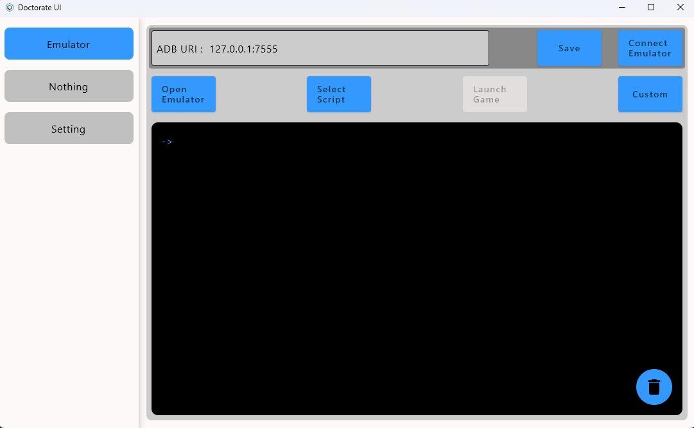

# Doctorate UI

## How to use
### Emulator

**You need install Python and Frida on your PC**
- Open Emulator ---> Choose your emulator.
- Select Script ---> Choose your frida hook script,This program will copy it locally.
- Launch Game ---> Enable when locally script exist,You need set android app package name.
- Custom ---> Allow you open custom applications.
### Setting

# Thanks
- [https://github.com/FantasticPornTaiQiang/ChatPTQ](https://github.com/FantasticPornTaiQiang/ChatPTQ)
- [Kotlin Multiplatform](https://www.jetbrains.com/help/kotlin-multiplatform-dev/get-started.html)